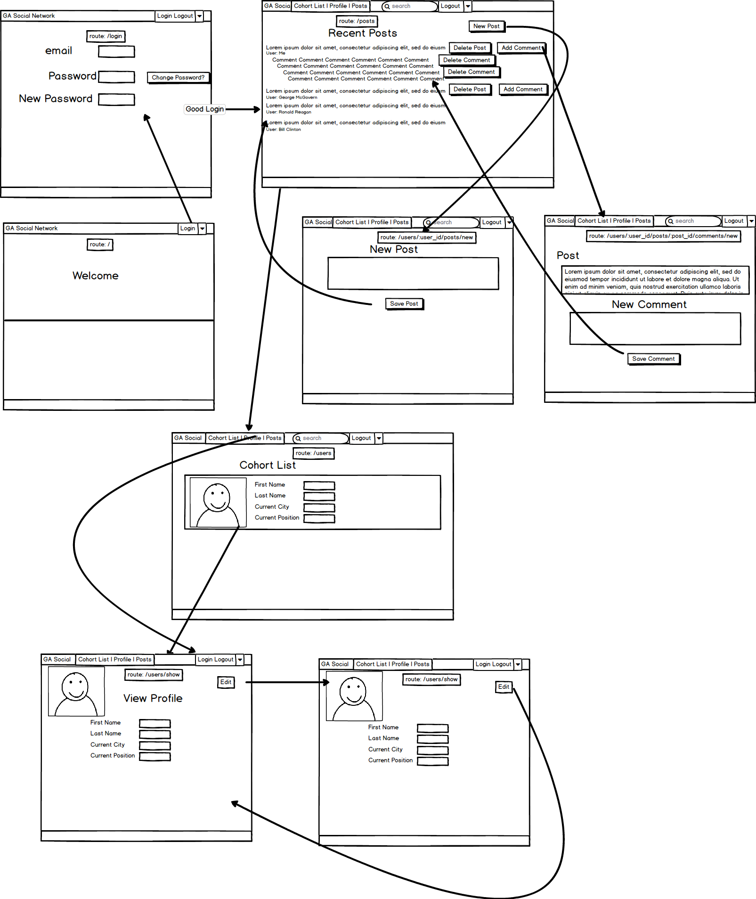
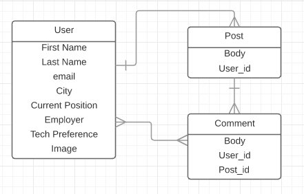

#GA Social

### GA Social is an app that allows WDI 27 & 28 to stay in touch.

##Main Functions
####1. User Profiles
####2. Posting (with file uploads)
####3. Commenting on posts
####4. Replies to comments
####5. Post search
####6. "Liking"
####7. In-App Private Messaging

##Special Features
####1. Password Reset
####2. Forgot Password (with email)
####3. Pagination
####4. Inline Editing of Posts and Comments
####5. Notifications when Post receives comments
####6. Pluralization
####7. Friendly Ids
####8. Sorting posts by most recent activity (including comments)
####9. Truncation and Readmore
####10. Modals

##Gems Used
1. friendly_id
2. closure_tree
3. devise
4. best_in_place
5. font_awesome_rails
6. mailboxer
8. will_paginate_bootstrap
9. data-confirm-modal
10. bootstrap-modal
11. bootstrap-saas
12. simple_form
13. pry-byebug
14. hirb

##Application Flow
  

##ER Diagram
  

##Getting Started
1. Clone down repository
2. Change directory into project
3. Run 'bundle install'
4. Run 'rake db:migrate'
5. Run 'rake db:seed'

##Team Members
1. Hila Vaisler
2. Bob Kliger
3. Sean Van Ho
4. Sam Huang
